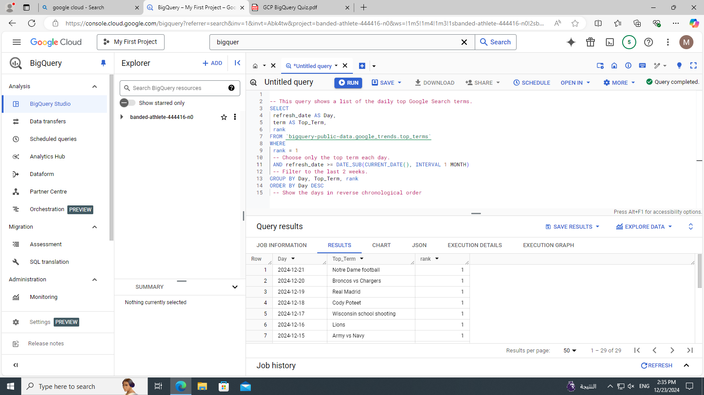
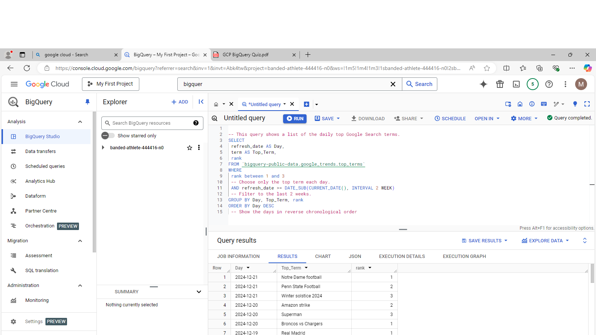
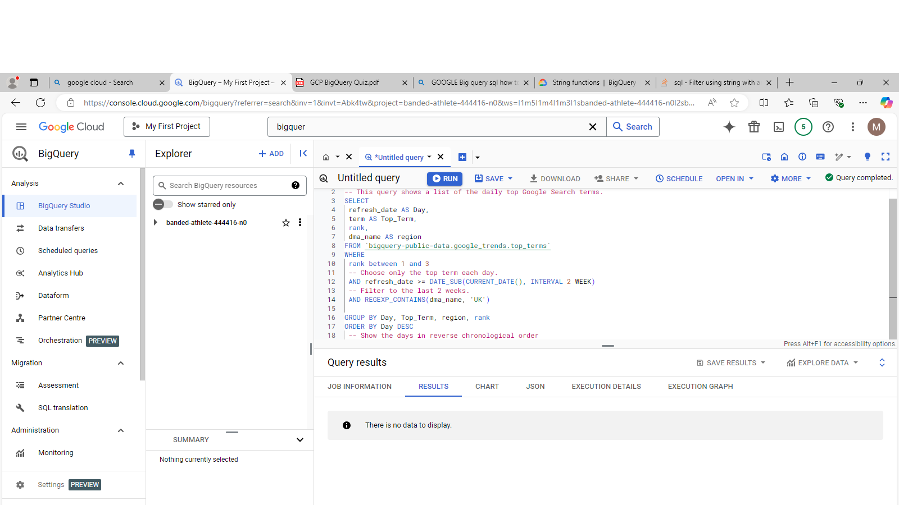
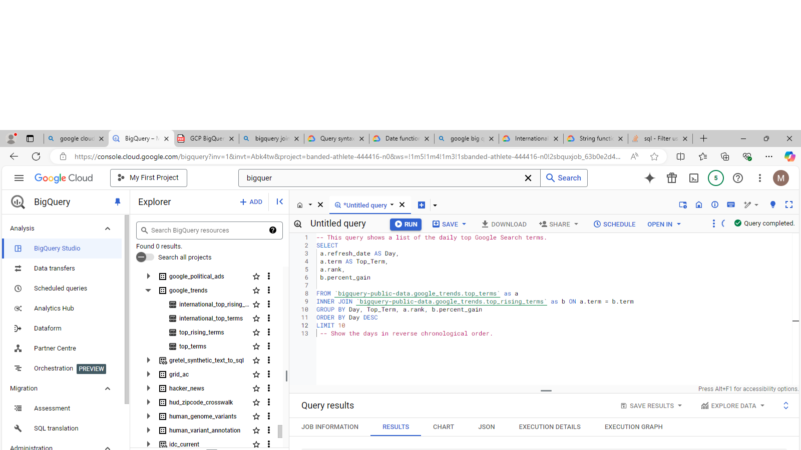
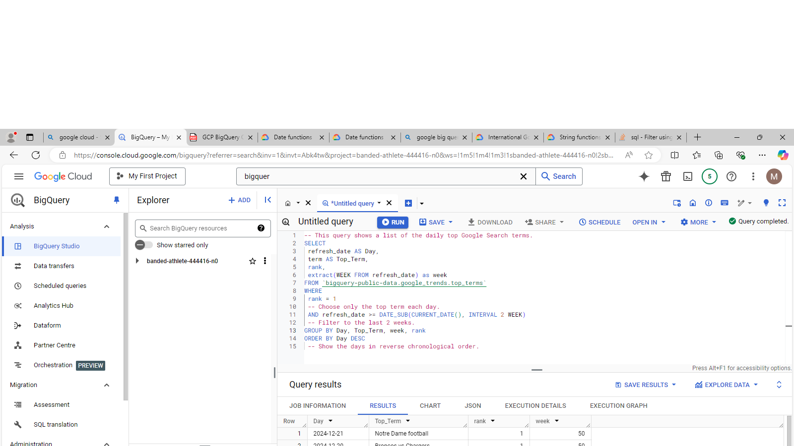

# bigquery
repo for code and results of quiz

### TASK 1

edited the interval from 2 weeks to 1 month

### TASK 2

edited the ranks filter to include values 1, 2 and 3

### TASK 3

searched for UK in a region using regex search function found no results

### TASK 4

used a join to connect two tables based on terms to get the percentage gain of score but found no matching terms so empty results

### TASK 5

extracted month using a date function and aggregated based on it
